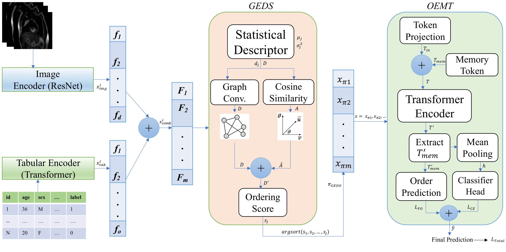

# iStructTab: Structured Feature Sequencing for Multimodal Learning of Image and Tabular Data


[](https://icpr2026.org/)


<p align="center">
  
</p>

iStructTab is a structured feature sequencing framework for **multimodal image-tabular learning**. It introduces **Graph-Enhanced Descriptor Sequencing (GEDS)** to derive an effective feature order from fused image and tabular representations, framing the problem through the lens of the **Column Permutation Problem (CPP)**. Instead of treating fused descriptors as an unordered vector, iStructTab explicitly organizes multimodal features into a structured sequence that reduces feature dispersion and improves cross-modal alignment. The ordered representation is processed by an **Order-Aware Efficient Transformer with Memory Augmentation (OEMT)**, which uses memory tokens and a sequencing-aware loss to preserve the learned feature order during prediction. This design makes iStructTab suitable for heterogeneous multimodal tasks involving images and tabular metadata, including medical imaging, remote sensing, environmental modeling, and other image-tabular prediction settings. Across diverse multimodal benchmarks, iStructTab improves classification accuracy, robustness, calibration, and efficiency compared with classical tabular models, image-only models, and recent multimodal learning baselines.

## Overview

**iStructTab** is a multimodal architecture for problems where each example has:

- **Tabular metadata** (numeric + categorical + optional text-like fields), and  
- **Image data** (e.g., medical images, natural images).
- iStructTab itself is **not specific** to HAM10000: any dataset with tabular + image inputs can be used by providing a matching PyTorch `Dataset` / `DataLoader`.

The key idea is to treat **both tabular features and image features as tokens**, then use **raph-Enhanced
Descriptor Sequencing (GEDS** to learn a global permutation over all tokens before feeding them to a transformer-like encoder (linformer).

## Citation

Al Zadid Sultan Bin Habib, Md Younus Ahamed, Prashnna Gyawali, Gianfranco Doretto, and Donald A. Adjeroh. **“iStructTab: Structured Feature Sequencing for Multimodal Learning of Image and Tabular Data.”** In *Proceedings of the 28th International Conference on Pattern Recognition (ICPR)*, Lyon, France, 2026.

BibTeX:
```bibtex
@inproceedings{habib2026istructtab,
  title     = {iStructTab: Structured Feature Sequencing for Multimodal Learning of Image and Tabular Data},
  author    = {Habib, Al Zadid Sultan Bin and Ahamed, Md Younus and Gyawali, Prashnna and Doretto, Gianfranco and Adjeroh, Donald A.},
  booktitle = {Proceedings of the 28th International Conference on Pattern Recognition},
  year      = {2026},
  address   = {Lyon, France}
}
```

## Files and Repository Structure

### Python package: `istructtab/`

This folder contains the core iStructTab implementation:

- `__init__.py` - Package initializer and high-level API exports.
- `iStructTab.py` - Main iStructTab implementation, including:
  - `set_seed` for reproducibility.
  - `ImageFeatureEncoder` for ResNet-based image feature extraction.
  - `TabularTokenEncoder` and `TabularEncoder` for numeric, categorical, and text-style tabular inputs.
  - `GEDS_GPU` for Graph-Enhanced Descriptor Sequencing.
  - `OEMT` for Order-Aware Efficient Transformer modeling with Linformer and memory tokens.
  - `iStructTab` as the high-level multimodal image-tabular model wrapper.

### Notebooks

- **`HAM_iStructTab.ipynb`**  
  Contains the full iStructTab experiment pipeline on the HAM10000 dataset. The notebook includes data preprocessing, multimodal image-tabular model setup, Optuna-based hyperparameter tuning, GEDS feature sequencing, OEMT training, evaluation, robustness checks, calibration analysis, and related diagnostic visualizations.

- **`iStructTab_PIP_Install_Check.ipynb`**  
  Demonstrates the installed `istructtab` package after `pip install`. The notebook includes import checks, package/version verification, basic API usage, initialization of the main iStructTab components, and a minimal toy workflow to confirm that the PyPI-installed package runs correctly.

### Main dependencies

The repository uses the following main dependencies:

```txt
numpy>=1.24
pandas>=2.0
scipy>=1.11

torch>=2.2
torchvision>=0.17
linformer>=0.2

scikit-learn>=1.3
optuna>=3.6

Pillow>=10.0
matplotlib>=3.7

### Other top-level files

- **`requirements.txt`** - Python dependencies required to run the iStructTab package and notebooks.
- **`iStructTab_Architecture.png`** - High-level architecture diagram of the iStructTab framework.
- **`HAM_iStructTab.ipynb`** - Full HAM10000 experiment notebook with Optuna tuning, training, evaluation, robustness checks, calibration analysis, and diagnostic visualizations.
- **`iStructTab_PIP_Install_Check.ipynb`** - Minimal notebook for checking the installed `istructtab` package, verifying imports, initializing core modules, and running a toy workflow.
- **`LICENSE`** - MIT license for this repository.
- **`README.md`** - Project overview, installation, usage instructions, repository structure, and citation information.
- **`.gitignore`** - Standard Git ignore rules for Python, Jupyter, cache files, checkpoints, and experiment outputs.
- **`pyproject.toml`** - Modern Python build-system and package metadata file for installation and PyPI upload.
- **`setup.cfg`** - Optional setuptools configuration file for package metadata and installation settings, if used alongside `pyproject.toml`.

### Tested Environment

- Python 3.10.13
- numpy 1.24.0+
- pandas 2.0.0+
- scipy 1.11.0+
- torch 2.2.0+
- torchvision 0.17.0+
- linformer 0.2.0+
- scikit-learn 1.3.0+
- optuna 3.6.0+
- Pillow 10.0.0+
- matplotlib 3.7.0+
- jupyterlab 4.0.0+

## Installation

You can install **iStructTab** in several ways depending on your workflow.

---

### Option 1: Clone the Repository (Recommended for Development)

```bash
git clone https://github.com/zadid6pretam/iStructTab.git
cd iStructTab
pip install -r requirements.txt
pip install -e .
```

### Option 2: Install Directly from GitHub (No Cloning Needed)

```bash
pip install "git+https://github.com/zadid6pretam/iStructTab.git"
```

### Option 3: Use a Virtual Environment

```bash
python -m venv istructtab-env
source istructtab-env/bin/activate  # On Windows: istructtab-env\Scripts\activate

git clone https://github.com/zadid6pretam/iStructTab.git
cd iStructTab
pip install -r requirements.txt
pip install -e .
```

### Option 4: Local Install Without Editable Mode

```bash
git clone https://github.com/zadid6pretam/iStructTab.git
cd iStructTab
pip install -r requirements.txt
pip install .
```

### Option 5: Install from PyPI

```bash
pip install istructtab
```
## Example Usage

Below is a minimal example showing how to train **iStructTab** on a dummy multimodal classification dataset with tabular features and image-like inputs.

```python
import numpy as np
import torch
from sklearn.datasets import make_classification
from sklearn.model_selection import train_test_split
from sklearn.preprocessing import StandardScaler

from istructtab import iStructTab, set_seed

# Reproducibility
set_seed(42)

# Device
device = "cuda" if torch.cuda.is_available() else "cpu"

# -------------------------------------------------------
# Dummy multimodal classification data
# -------------------------------------------------------
num_samples = 300
num_tab_features = 40
num_classes = 3
image_size = 64

X_tab, y = make_classification(
    n_samples=num_samples,
    n_features=num_tab_features,
    n_informative=15,
    n_redundant=10,
    n_classes=num_classes,
    random_state=42,
)

X_tab = X_tab.astype(np.float32)
y = y.astype(np.int64)

# Dummy image inputs: (N, C, H, W)
X_img = np.random.rand(num_samples, 3, image_size, image_size).astype(np.float32)

# Train/test split
X_tab_train, X_tab_test, X_img_train, X_img_test, y_train, y_test = train_test_split(
    X_tab,
    X_img,
    y,
    test_size=0.2,
    random_state=42,
    stratify=y,
)

# Standardize tabular features
scaler = StandardScaler()
X_tab_train = scaler.fit_transform(X_tab_train).astype(np.float32)
X_tab_test = scaler.transform(X_tab_test).astype(np.float32)

# Convert to tensors
X_tab_train = torch.tensor(X_tab_train, dtype=torch.float32).to(device)
X_tab_test = torch.tensor(X_tab_test, dtype=torch.float32).to(device)

X_img_train = torch.tensor(X_img_train, dtype=torch.float32).to(device)
X_img_test = torch.tensor(X_img_test, dtype=torch.float32).to(device)

y_train = torch.tensor(y_train, dtype=torch.long).to(device)
y_test = torch.tensor(y_test, dtype=torch.long).to(device)

# -------------------------------------------------------
# Initialize iStructTab
# -------------------------------------------------------
model = iStructTab(
    num_tab_features=num_tab_features,
    num_classes=num_classes,
    d_model=128,
    tab_depth=2,
    tab_heads=4,
    oemt_k=64,
    oemt_M=10,
    oemt_heads=4,
    oemt_layers=2,
    linformer_k=32,
    lambda_fs=0.1,
    pretrained_resnet=False,
    img_in_channels=3,
).to(device)

optimizer = torch.optim.AdamW(model.parameters(), lr=1e-4, weight_decay=1e-4)

# -------------------------------------------------------
# Train
# -------------------------------------------------------
model.train()

epochs = 5
batch_size = 32

for epoch in range(epochs):
    permutation = torch.randperm(X_tab_train.size(0), device=device)
    total_loss = 0.0

    for start in range(0, X_tab_train.size(0), batch_size):
        idx = permutation[start:start + batch_size]

        batch_tab = X_tab_train[idx]
        batch_img = X_img_train[idx]
        batch_y = y_train[idx]

        optimizer.zero_grad()

        out = model(batch_tab, batch_img, y=batch_y)
        loss = out["loss"]

        loss.backward()
        optimizer.step()

        total_loss += loss.item() * batch_tab.size(0)

    avg_loss = total_loss / X_tab_train.size(0)
    print(f"Epoch {epoch + 1}/{epochs} | Loss: {avg_loss:.4f}")

# -------------------------------------------------------
# Evaluate
# -------------------------------------------------------
model.eval()

with torch.no_grad():
    out = model(X_tab_test, X_img_test)
    logits = out["logits"]
    preds = logits.argmax(dim=1)

    accuracy = (preds == y_test).float().mean().item()

print(f"Test accuracy: {accuracy:.4f}")
print("GEDS feature sequence shape:", out["sequence"].shape)
print("GEDS scores shape:", out["geds_scores"].shape)
```

- The returned output dictionary contains the model predictions, GEDS sequencing information, feature-sequencing scores, and optional training losses. For supervised classification, iStructTab returns:

```python
{
    "logits": ...,       # Tensor of shape (B, num_classes)
    "sequence": ...,     # Tensor of shape (m,), learned GEDS feature order
    "geds_scores": ...,  # Tensor of shape (m,), GEDS feature scores
    "fs_scores": ...,    # Tensor of shape (B, m), OEMT-predicted feature-sequencing scores
    "beta": ...,         # Tensor of shape (B, m), target sequencing vector

    # Returned only when labels y are provided
    "loss": ...,         # Total loss = CE loss + lambda_fs * feature-sequencing loss
    "loss_ce": ...,      # Cross-entropy classification loss
    "loss_fs": ...       # Feature-sequencing regularization loss
}
```

- For binary classification, set:

```python
num_classes = 2

model = iStructTab(
    num_tab_features=num_tab_features,
    num_classes=num_classes,
    d_model=128,
    tab_depth=2,
    tab_heads=4,
    oemt_k=64,
    oemt_M=10,
    oemt_heads=4,
    oemt_layers=2,
    linformer_k=32,
    lambda_fs=0.1,
    pretrained_resnet=False,
    img_in_channels=3,
)
```

- During evaluation, predictions can be obtained from `out["logits"]`, and standard classification metrics such as accuracy, precision, recall, and F1-score can be computed using `scikit-learn`.

```python
from sklearn.metrics import accuracy_score, precision_score, recall_score, f1_score

model.eval()

with torch.no_grad():
    out = model(X_tab_test, X_img_test)
    preds = out["logits"].argmax(dim=1).cpu().numpy()
    y_true = y_test.cpu().numpy()

metrics = {
    "accuracy": accuracy_score(y_true, preds),
    "macro_precision": precision_score(y_true, preds, average="macro", zero_division=0),
    "macro_recall": recall_score(y_true, preds, average="macro", zero_division=0),
    "macro_f1": f1_score(y_true, preds, average="macro", zero_division=0),
}

print(metrics)
```

## For fuller experiments, Optuna tuning, and diagnostic analysis, see:

- **`HAM_iStructTab.ipynb`**

This notebook contains the full HAM10000 experiment from the iStructTab workflow, including multimodal image-tabular preprocessing, Optuna-based hyperparameter tuning, GEDS feature sequencing, OEMT training, evaluation metrics, robustness checks, calibration analysis, and diagnostic visualizations.

- **`iStructTab_PIP_Install_Check.ipynb`**

This notebook provides a minimal installation check for the PyPI/GitHub-installed `istructtab` package, including import verification, package/version checks, initialization of core iStructTab components, and a small toy workflow to confirm that the installed package runs correctly.


## Related Work and Project Context

iStructTab is part of my PhD research on structured tabular and multimodal deep learning, with a focus on feature ordering/sequencing, and representation learning for heterogeneous data. The project extends my broader research direction on order-aware tabular modeling by studying how image and tabular representations can be fused through a structured feature sequence rather than treated as an unordered concatenated vector.

In this work, iStructTab formulates multimodal image-tabular fusion as a feature sequencing problem inspired by the Column Permutation Problem (CPP). It introduces Graph-Enhanced Descriptor Sequencing (GEDS) to construct a data-driven feature order and uses an Order-Aware Efficient Transformer with Memory Augmentation (OEMT) to preserve and exploit that order during prediction. This connects directly to my dissertation research themes on feature ordering, structure-aware representation learning, and efficient deep learning for tabular and multimodal data.

### GOTabPFN

Our recent ICML 2026 Regular main conference paper on feature ordering and compression for tabular foundation models:
- GOTabPFN: From Feature Ordering to Compact Tokenization for Tabular Foundation Models on High-Dimensional Data
GitHub: https://github.com/zadid6pretam/GOTabPFN

```bibtex
@inproceedings{habib2026gotabpfn,
  title     = {GOTabPFN: From Feature Ordering to Compact Tokenization for Tabular Foundation Models on High-Dimensional Data},
  author    = {Habib, Al Zadid Sultan Bin and Ahamed, Md Younus and Gyawali, Prashnna Kumar and Doretto, Gianfranco and Adjeroh, Donald A.},
  booktitle = {Proceedings of the 43rd International Conference on Machine Learning},
  year      = {2026}
}
```

### BSTabDiff

Our generative modeling framework for high-dimensional low-sample-size tabular data:
- BSTabDiff: Block-Subunit Diffusion Priors for High-Dimensional Tabular Data Generation
GitHub: https://github.com/zadid6pretam/BSTabDiff

```bibtex
@inproceedings{habib2026bstabdiff,
  title     = {BSTabDiff: Block-Subunit Diffusion Priors for High-Dimensional Tabular Data Generation},
  author    = {Habib, Al Zadid Sultan Bin and Ahamed, Md Younus and Gyawali, Prashnna Kumar and Doretto, Gianfranco and Adjeroh, Donald A.},
  booktitle = {ICLR 2026 2nd Workshop on Deep Generative Models in Machine Learning: Theory, Principle and Efficacy (DeLTa)},
  year      = {2026}
}
```
- If you are interested in high-dimensional tabular synthesis, block-subunit generation, and diffusion/flow priors for HDLSS tabular data, please also refer to the BSTabDiff repository and paper.

### iStructTab

Our structured feature sequencing framework for multimodal learning with image and tabular data. This work is part of my PhD research on feature sequencing or ordering for multimodal image-tabular representation learning.

- **iStructTab: Structured Feature Sequencing for Multimodal Learning of Image and Tabular Data**  
  GitHub: https://github.com/zadid6pretam/iStructTab

```bibtex
@inproceedings{habib2026istructtab,
  title     = {iStructTab: Structured Feature Sequencing for Multimodal Learning of Image and Tabular Data},
  author    = {Habib, Al Zadid Sultan Bin and Ahamed, Md Younus and Gyawali, Prashnna and Doretto, Gianfranco and Adjeroh, Donald A.},
  booktitle = {Proceedings of the 28th International Conference on Pattern Recognition},
  year      = {2026},
  address   = {Lyon, France}
}
```
- If you are interested in structured feature sequencing, multimodal fusion of image and tabular data (the integration problem), and feature order-aware tabular representation learning, please also refer to the iStructTab repository and paper.

## DynaTab

Our more recent work on learned feature ordering for high-dimensional tabular data:

- **DynaTab: Dynamic Feature Ordering as Neural Rewiring for High-Dimensional Tabular Data**
GitHub: https://github.com/zadid6pretam/DynaTab

```bibtex
@inproceedings{habib2026dynatab,
  title     = {{DynaTab: Dynamic Feature Ordering as Neural Rewiring for High-Dimensional Tabular Data}},
  author    = {Habib, Al Zadid Sultan Bin and Doretto, Gianfranco and Adjeroh, Donald A.},
  booktitle = {Proceedings of the AAAI 2026 First International Workshop on Neuro for AI \& AI for Neuro: Towards Multi-Modal Natural Intelligence (NeuroAI)},
  year      = {2026},
  series    = {PMLR}
}
```
- If you are interested in learned feature ordering, neural rewiring for high-dimensional tabular data, and sequential backbone design for HDLSS settings, please also refer to the DynaTab repository and paper.
- DynaTab has completed camera-ready submission, and the public proceedings version is expected to appear online later.


### TabSeq

Our earlier work on sequential modeling for tabular data:

- **TabSeq: A Framework for Deep Learning on Tabular Data via Sequential Ordering**  
  GitHub: https://github.com/zadid6pretam/TabSeq  
  Springer ICPR 2024 proceedings: https://link.springer.com/chapter/10.1007/978-3-031-78128-5_27

```bibtex
@inproceedings{habib2024tabseq,
  title={TabSeq: A Framework for Deep Learning on Tabular Data via Sequential Ordering},
  author={Habib, Al Zadid Sultan Bin and Wang, Kesheng and Hartley, Mary-Anne and Doretto, Gianfranco and A. Adjeroh, Donald},
  booktitle={International Conference on Pattern Recognition},
  pages={418--434},
  year={2024},
  organization={Springer}
}
```
- If you are interested in sequential ordering for tabular data, deep sequential backbones, and early feature-ordering-based tabular modeling, please also refer to the TabSeq repository and paper.


----------------------------------------------------------------------------------------------------------------------------------------------------------


### ZAYAN

This repository corresponds to our separate collaborative work on tabular remote sensing and environmental data:
- ZAYAN: Disentangled Contrastive Transformer for Tabular Remote Sensing Data
GitHub: https://github.com/zadid6pretam/ZAYAN

```bibtex
@inproceedings{habib2026zayan,
  title     = {ZAYAN: Disentangled Contrastive Transformer for Tabular Remote Sensing Data},
  author    = {Habib, Al Zadid Sultan Bin and Tasnim, Tanpia and Islam, Md. Ekramul and Tabasum, Muntasir},
  booktitle = {Proceedings of the 28th International Conference on Pattern Recognition},
  year      = {2026},
  address   = {Lyon, France}
}
```
- ZAYAN focuses on feature-level contrastive learning and Transformer-based classification for tabular remote sensing and environmental datasets.
- Unlike my PhD dissertation projects on high-dimensional tabular learning and HDLSS modeling, ZAYAN was developed as a separate collaboration.

## Contact

For any questions, issues, or suggestions related to this repository, please feel free to contact us or open an issue on GitHub.


## Repository Structure

A typical layout is:

```text
.
├── istructtab/
│   ├── __init__.py
│   └── iStructTab.py                    # Core iStructTab implementation: GEDS + OEMT
├── HAM_iStructTab.ipynb                 # Full HAM10000 experiment with Optuna tuning and diagnostics
├── iStructTab_PIP_Install_Check.ipynb   # Minimal pip-install/import/API check notebook
├── iStructTab_Architecture.png          # High-level architecture diagram
├── requirements.txt                     # Runtime dependencies
├── pyproject.toml                       # Build system and PyPI metadata
├── setup.cfg                            # Optional setuptools configuration
├── LICENSE                              # MIT license
├── .gitignore                           # Git ignore rules
└── README.md                            # Project overview, installation, usage, and citation


